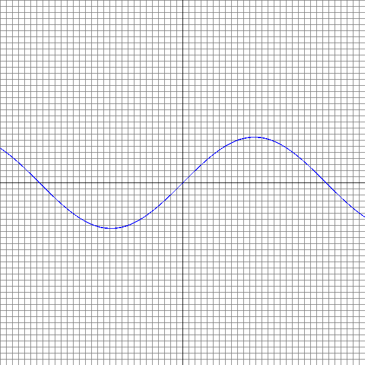

# CVIS: Function Visualiser written in C for X11 and Wayland

```sh
Building:
$ xbps-install -Su libX11-devel MesaLib-devel  [or whatever your distro equivalent is] 
$ make

Using:
$ cvis sin(x)
```



